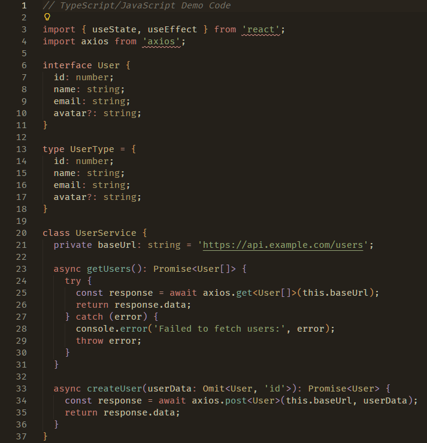

# Soft Sunset Dark Theme

A calm sunset theme in neon tones with subtle coastline hues for relaxed coding sessions.

## 🌅 Features

- **Calming Color Palette**: Soft sunset-inspired neon tones with coastline hues
- **Eye-Friendly**: Designed for extended coding sessions with reduced eye strain
- **Modern Aesthetic**: Contemporary dark theme with vibrant accents
- **VS Code Compatible**: Fully compatible with VS Code 1.80.0 and later

## 📸 Preview

### JavaScript Syntax Highlighting

## 📦 Installation

### From VS Code Marketplace

1. Open VS Code
2. Press `Ctrl+Shift+X` to open the Extensions panel
3. Search for "Soft Sunset Dark"
4. Click **Install**

[📥 Install from VS Code Marketplace](https://marketplace.visualstudio.com/items?itemName=brainkit.soft-sunset-dark)

### Manual Installation

1. Download the latest `.vsix` file from [Releases](https://github.com/brainkit/vs-code-soft-sunset-dark-theme/tree/main/releases)
2. In VS Code, press `Ctrl+Shift+P` and type "Extensions: Install from VSIX"
3. Select the downloaded `.vsix` file

## 🎨 Usage

1. After installation, press `Ctrl+Shift+P`
2. Type "Preferences: Color Theme" and press Enter
3. Select **Soft Sunset Dark** from the list

## ⚙️ Requirements

- VS Code version: `^1.80.0`
- Extension kind: `UI`

## 📄 License

This project is licensed under the MIT License - see the [LICENSE.md](LICENSE.md) file for details.

## 👤 Author

**brainkit** - [Telegram](https://t.me/brainkit)

## 🤝 Contributing

Contributions are welcome! Please feel free to submit a Pull Request.

1. Fork the repository
2. Create your feature branch (`git checkout -b feature/AmazingFeature`)
3. Commit your changes (`git commit -m 'Add some AmazingFeature'`)
4. Push to the branch (`git push origin feature/AmazingFeature`)
5. Open a Pull Request

## 📝 Changelog

### Version 0.0.17 (Current)

- **Improved readability**: Enhanced comment contrast for comfortable reading
- **Better hierarchy**: Optimized variable and function colors for clearer code structure
- **Relaxed coding focus**: Fine-tuned colors to maintain the calm, sunset-inspired atmosphere
- **Consistency**: Unified improvements across both standard and OLED versions

### Version 0.0.5

- Updated theme colors for better contrast
- Improved syntax highlighting
- Enhanced editor workspace colors
- Better support for additional languages

### Version 0.0.4

- Initial release
- Soft sunset color palette
- Full VS Code integration
- Ready for marketplace publishing

### Version 0.0.1

- Initial development

---

Made with ❤️ for comfortable coding sessions
